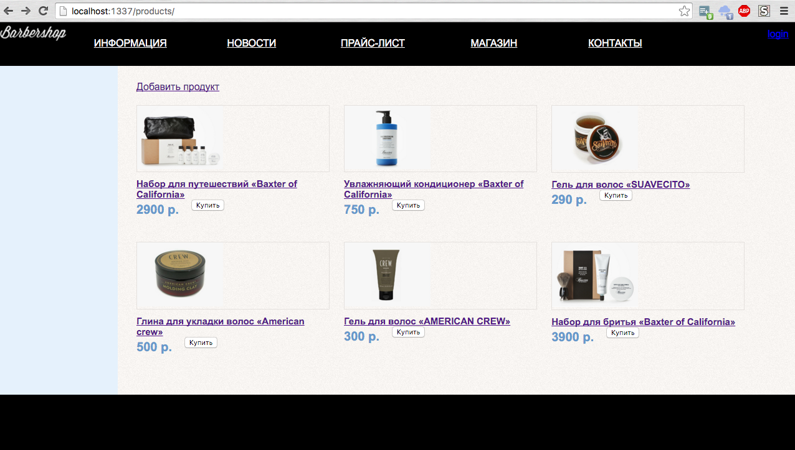

# simple-store-sails

a [Sails](http://sailsjs.org) application


### How to run

```bash
npm i
npm run deps
npm run make-views
./node_modules/.bin/sails lift --verbose
```

go to [products](http://localhost:1337/products/)



### How to deploy to ubuntu server

```bash
#!/bin/sh

sudo apt-get update && sudo apt-get upgrade

sudo locale-gen ru_RU.UTF-8
sudo dpkg-reconfigure locales
curl -sL https://deb.nodesource.com/setup | sudo bash -

sudo apt-get install nodejs
sudo apt-get install build-essential
sudo apt-get install imagemagick
sudo apt-get install git
sudo apt-get install nginx
sudo apt-get install mongodb

sudo mkdir /var/www && cd /var/www/
sudo git clone https://github.com/bem-under-sailsjs/barbershop-bem-sails barbershop
sudo chown -R %username%:%username% barbershop
cd barbershop

npm i
npm run deps
npm run make-views
./node_modules/.bin/sails lift --verbose
```
